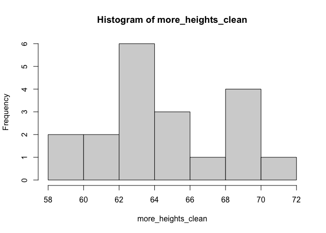

Introduction to R, Class 1: Solutions
================

<!--class1_solutions.md is generated from class1_solutions.Rmd. Please edit that file -->

#### Challenge-hist

The function `hist` creates a histogram.

Its main arguments are: - x: vector of values for which the histogram is
desired - breaks: breakpoints for cells - …

This can be determined using `?hist`

#### Challenge-values

``` r
mass <- 47.5              # mass = 47.5
width  <- 122             # width = 122
mass <- mass * 2.0        # mass = 95 (replaces previous mass object)
width  <- width - 20      # width = 102 (replace previous width object)
mass_index <- mass/width  # mass_index = 0.9313725 (uses second assigned values for each)
```

#### Challenge-organs

``` r
# creating vector
organs <- c("lung", "prostate", "breast")
# How many things are in organs?
length(organs)
```

    ## [1] 3

``` r
# what type of data is organs?
class(organs)
```

    ## [1] "character"

``` r
# get overview of organs
str(organs)
```

    ##  chr [1:3] "lung" "prostate" "breast"

#### Challenge-dtypes

``` r
num_char <- c(1, 2, 3, "a")
class(num_char) # data are character
```

    ## [1] "character"

``` r
num_logical <- c(1, 2, 3, TRUE)
class(num_logical) # data are numerical
```

    ## [1] "numeric"

``` r
char_logical <- c("a", "b", "c", TRUE)
class(char_logical) # data are character
```

    ## [1] "character"

``` r
tricky <- c(1, 2, 3, "4")
class(tricky) # data are character
```

    ## [1] "character"

#### Challenge-compare

R interprets these as character data, and five comes before four
alphabetically, which is used to assess the logic statement

#### Challenge-analyze

``` r
# create vector
more_heights <- c(63, 69, 60, 65, NA, 68, 61, 70, 61, 59, 64, 69, 63, 63, NA, 72, 65, 64, 70, 63, 65)
# remove NAs from heights
more_heights_clean <- na.omit(more_heights)
# calculate median of heights (multiple answers)
median(more_heights, na.rm = TRUE)
```

    ## [1] 64

``` r
median(more_heights_clean)
```

    ## [1] 64

``` r
# identify how many elements from more_heights are greater than 67 inches
length(more_heights[more_heights > 67])
```

    ## [1] 8

``` r
# visualize data as a histogram (hint: function hist)
hist(more_heights_clean)
```

<!-- -->

## Extra exercises

#### Challenge-objects

``` r
# create an object called agge that contains your age in years
agge <- 35
# reassign the object to a new object called age (e.g., correct the typo)
age <- agge
# remove the previous object from your environment
rm(agge)
# calculate your age in days
age * 365
```

    ## [1] 12775

#### Challenge-num

``` r
# create a object representing a vector that contains the names of buildings on Fred Hutch's campus: https://www.fredhutch.org/en/contact-us/visit-us.html
buildings <- c("Arnold", "Yale", "Thomas", "Weintraub", "Hutchinson", "Eastlake")
# add Seattle, Washington to the beginning of the vector, and Steam Plant to the end of the vector
buildings <- c("Seattle, Washington", buildings, "Steam Plant")
# subset the vector to show only the building in which you work
buildings[2] # for Arnold
```

    ## [1] "Arnold"

#### Challenge-char

``` r
# the following vector represents the number of vacation days possessed by various employees
vacation_days <- c(5, 7, 20, 1, 0, 0, 12, 4, 2, 2, 2, 4, 5, 6, 7, 10, 4)
# how many employees are represented in the vector?
length(vacation_days)
```

    ## [1] 17

``` r
# how many employees have at least one work week's worth of vacation available to them?
length(vacation_days[vacation_days >= 5])
```

    ## [1] 8
